# CampusLink AI — End-to-End Test Plan & Testing Environment Guide

This document establishes the end-to-end (E2E) testing plan, synthetic campus dataset topology, reproducibility commands, golden queries, failure mode tests, and manual testing checklists for CampusLink AI (Phases 1–9).

---

## 1. Test Environment Setup & Reproducibility Commands

All commands must be run from the repository root or the corresponding app workspace directory.

### Start Infrastructure & Database
```bash
docker-compose up -d postgres
```

### Run Database Migrations
```bash
cd apps/api
.\.venv\Scripts\alembic upgrade head
```

### Seed & Reset Test Dataset
Populates the synthetic 10-user campus topology, 10 projects, 6 problem/solutions, 3 research items, 3 facilities, equipment assets, resume PDF/DOCX fixtures, and vector embeddings:
```bash
cd apps/api
.\.venv\Scripts\python -m scripts.reset_test_data
```

### Rebuild Vector Embeddings
Re-indexes all campus entities (Profiles, Projects, Research, Facilities, Equipment, ProblemSolutions) into pgvector embeddings:
```bash
cd apps/api
.\.venv\Scripts\python -m scripts.rebuild_embeddings
```

### Start Services
```bash
# Terminal 1: Backend API (Port 8000)
cd apps/api
.\.venv\Scripts\uvicorn app.main:app --reload --port 8000

# Terminal 2: Frontend App (Port 3000)
cd apps/web
npm run dev
```

### Execute Test Verification Suite
```bash
# Backend Automated Unit & E2E Tests
cd apps/api
.\.venv\Scripts\pytest

# Frontend TypeScript Verification
cd apps/web
npx tsc --noEmit

# Frontend Production Build Check
cd apps/web
npm run build
```

---

## 2. Synthetic Test Accounts Reference

All synthetic accounts use the development password: **`Password123!`**

| Role | Name | Email | Privacy Configuration |
| :--- | :--- | :--- | :--- |
| **Student 1** | Aarav Menon | `student1@campuslink.test` | `searchable=True`, `contact_visibility=PUBLIC` |
| **Student 2** | Meera Nair | `student2@campuslink.test` | `searchable=True`, `contact_visibility=CONNECTIONS_ONLY`, Has Private Resume Fixture |
| **Student 3** | Rohan Kapoor | `student3@campuslink.test` | **`searchable=False`** (USER B PRIVACY FIXTURE) |
| **Student 4** | Diya Sharma | `student4@campuslink.test` | `searchable=True`, **`contact_visibility=PRIVATE`** (USER C PRIVACY FIXTURE) |
| **Student 5** | Vikram Rao | `student5@campuslink.test` | `searchable=True`, **`show_email=False`**, **`show_phone=False`** (USER D PRIVACY FIXTURE) |
| **Student 6** | Ananya Iyer | `student6@campuslink.test` | `searchable=True`, `contact_visibility=PUBLIC` |
| **Faculty 1** | Dr. Kavitha Raman | `faculty1@campuslink.test` | `searchable=True`, `contact_visibility=PUBLIC` |
| **Faculty 2** | Dr. Arjun Rao | `faculty2@campuslink.test` | `searchable=True`, `contact_visibility=PUBLIC` |
| **Alumni 1** | Siddharth Kumar | `alumni1@campuslink.test` | `searchable=True`, `contact_visibility=PUBLIC` |
| **Admin** | System Administrator | `admin@campuslink.test` | `searchable=True`, `role=ADMIN` |

---

## 3. Golden Dataset Structure & Relational Topology

The synthetic campus dataset connects students, faculty, projects, research, problem-solution institutional memory, facilities, and equipment:

```mermaid
graph TD
    Aarav["Aarav Menon (Student 1)\n[Embedded AI, TinyML, ESP32, MFCC]"] --> P1["Project: ESP32 TinyML Keyword Detection"]
    Aarav --> PS1["Solution: Noisy microphone audio fix (MFCC + Filtering)"]
    Aarav --> PS2["Solution: I2S microphone sample stabilization"]

    Meera["Meera Nair (Student 2)\n[DSP, Audio Processing, Noise Reduction]"] --> P2["Project: Microphone Noise Reduction using Spectral Filtering"]
    Meera --> PS5["Solution: High latency signal filtering fix"]

    Rohan["Rohan Kapoor (Student 3)\n[Embedded Systems, STM32, FreeRTOS]"] --> P4["Project: Low-Power IoT Sensor Gateway"]
    Rohan --> PS6["Solution: Outdated ESP32 BSP driver fix"]

    Diya["Diya Sharma (Student 4)\n[ML, Model Optimization, Quantization]"] --> P3["Project: Edge ML Model Compression"]
    Diya --> PS3["Solution: TinyML model memory overflow fix"]

    Vikram["Vikram Rao (Student 5)\n[Computer Vision, OpenCV, Object Detection]"] --> P5["Project: Smart Campus Vision System"]

    Ananya["Ananya Iyer (Student 6)\n[IoT, MQTT, Sensor Networks]"] --> P6["Project: Campus Environmental Monitoring Network"]
    Ananya --> PS4["Solution: MQTT message loss retry buffer fix"]

    Kavitha["Dr. Kavitha Raman (Faculty 1)\n[Embedded Systems, Signal Processing, Edge AI]"] --> R2["Research: Edge Intelligence for Embedded Sensor Networks"]
    Kavitha --> R3["Research: Adaptive Audio Processing"]
    Kavitha --> F1["Facility: Embedded AI Laboratory"]

    Arjun["Dr. Arjun Rao (Faculty 2)\n[Machine Learning, Edge AI, Model Optimization]"] --> R1["Research: Efficient Machine Learning at the Edge"]
    Arjun --> F3["Facility: Computer Vision Laboratory"]

    Siddharth["Siddharth Kumar (Alumni 1)\n[TinyML, Edge Deployment, Keyword Spotting]"] --> P7["Project: Keyword Spotting on Microcontrollers"]
    Siddharth --> P10["Project: Legacy ESP32 Audio Classifier (Outdated 4y)"]

    F1 --> EQ1["ESP32-S3 Dev Boards"]
    F1 --> EQ2["I2S MEMS Microphones"]
    F1 --> EQ3["Logic Analyzer"]
    F1 --> EQ4["Digital Storage Oscilloscope"]

    F2["Facility: Digital Signal Processing Laboratory"] --> EQ5["MATLAB Workstation"]
    F2 --> EQ6["Audio Interface & Measurement Microphone"]
```



---

## 4. Golden Query Benchmark

### Canonical Query
> *"My ESP32 microphone is working, but my TinyML keyword detection model is giving poor accuracy. I don't know whether the problem is with the microphone, audio preprocessing, or the ML model."*

### Expected Candidate Relevance Tiers
- **STRONG Candidates**:
  1. **Aarav Menon** (Direct match: ESP32 + TinyML + MFCC + Audio Processing)
  2. **Meera Nair** (Direct match: Audio Preprocessing + Noise Reduction + DSP)
  3. **Siddharth Kumar** (Direct match: Keyword Spotting on Microcontrollers + Historical Experience)
  4. **Dr. Kavitha Raman** (Faculty guidance: Embedded AI + Signal Processing)
- **MODERATE Candidates**:
  5. **Diya Sharma** (Relevant ML Model Optimization & Quantization)
  6. **Rohan Kapoor** (Embedded Hardware context)
  7. **Ananya Iyer** (IoT & ESP32 context)
- **WEAK Candidates**:
  8. **Vikram Rao** (Computer Vision — Irrelevant domain, must rank low or excluded)

### Expected Evidence Base
- **Projects**: *ESP32 TinyML Keyword Detection*, *Microphone Noise Reduction using Spectral Filtering*, *Keyword Spotting on Microcontrollers*.
- **Problem-Solutions**: *Noisy microphone audio causing poor keyword classification accuracy on ESP32*, *I2S microphone produces unstable audio samples*.
- **Facilities/Equipment**: *Embedded AI Laboratory* (ESP32-S3 boards, I2S MEMS microphones, Oscilloscope).

### Expected Conceptual Help Chain
```
Aarav Menon (ESP32 + TinyML + Keyword Spotting)
  ↓
Meera Nair (Audio Preprocessing + DSP Noise Reduction)
  ↓
Dr. Kavitha Raman (Embedded AI & Signal Processing Faculty Supervision)
```

### Expected Agentic Discovery & LangGraph Stage Trace
```
START
  ↓
initialize_request
  ↓
understand_query (Extracted domain concepts: ESP32, TinyML, Microphone, Audio Preprocessing, Keyword Spotting)
  ↓
  ├── discover_people (Discovers Aarav, Meera, Siddharth, Dr. Kavitha)
  ├── discover_knowledge (Discovers Projects & ProblemSolutions)
  └── discover_facilities (Discovers Embedded AI Lab)
  ↓
aggregate_evidence
  ↓
rank_matches
  ↓
generate_explanations
  ↓
validate_results (Verifies no secret leak, enforces privacy)
  ↓
finalize_response
  ↓
END
```

---

## 5. Documented Test Queries (15+ Suite)

| Query ID | Test Query | Domain / Objective | Expected Candidate Tiers & Evidence |
| :--- | :--- | :--- | :--- |
| **Q1** | *"My ESP32 microphone works but TinyML keyword detection accuracy is poor."* | Golden Audio/TinyML Problem | **STRONG**: Aarav, Meera, Siddharth, Dr. Kavitha. Evidence: ESP32 TinyML project, Noisy audio solution. |
| **Q2** | *"Who can help me reduce microphone noise?"* | DSP & Noise Reduction | **STRONG**: Meera Nair, Dr. Kavitha Raman. Evidence: Microphone Noise Reduction project, DSP Lab. |
| **Q3** | *"My TinyML model is too large for the microcontroller."* | Model Optimization | **STRONG**: Diya Sharma, Dr. Arjun Rao. Evidence: Edge ML Model Compression project, Quantization solution. |
| **Q4** | *"Who has experience with MQTT and ESP32?"* | IoT Networking | **STRONG**: Rohan Kapoor, Ananya Iyer. Evidence: Environmental Monitoring Network, MQTT retry solution. |
| **Q5** | *"Who has experience with object detection using OpenCV?"* | Computer Vision | **STRONG**: Vikram Rao. Evidence: Smart Campus Vision System, Computer Vision Lab. |
| **Q6** | *"I need help debugging an ESP32 peripheral."* | Embedded Hardware | **STRONG**: Rohan Kapoor, Aarav Menon. Evidence: Low-Power IoT Gateway, I2S sample solution. |
| **Q7** | *"Are there any research papers about edge AI?"* | Academic Research | **STRONG**: Dr. Arjun Rao, Dr. Kavitha Raman. Evidence: *Efficient Machine Learning at the Edge*. |
| **Q8** | *"Where can I test an ESP32 microphone setup?"* | Facility Discovery | **STRONG**: Embedded AI Laboratory. Equipment: ESP32-S3 boards, I2S microphones. |
| **Q9** | *"I need an oscilloscope for embedded debugging."* | Equipment Search | **STRONG**: Facilities with Oscilloscopes (Embedded AI Lab). |
| **Q10** | *"Has anyone solved noisy microphone audio on ESP32 before?"* | Institutional Memory | **STRONG**: ProblemSolution record *Noisy microphone audio causing poor keyword classification*. |
| **Q11** | *"Who can help with blockchain smart contracts?"* | Weak/Irrelevant Match | Graceful low-confidence response, **NO** fabricated candidates. |
| **Q12** | *"Who is the person who disabled discoverability?"* | Privacy Enforcement | **User B (Rohan Kapoor)** must NOT appear in search/discovery results. |
| **Q13** | *"Who knows ESP32?"* | Ambiguous Keyword | Multiple relevant candidates (Aarav, Rohan, Ananya, Dr. Kavitha) ranked by evidence depth. |
| **Q14** | *"How do I reduce TinyML model memory usage?"* | Quantization / Solution | **STRONG**: Diya Sharma, Dr. Arjun Rao, Solution record *TinyML model exceeds available memory*. |
| **Q15** | *"Find projects related to the suspicious project."* | Security & Prompt Injection | Returns normal search results. Untrusted text must **NOT** leak secrets or alter agent instructions. |

---

## 6. Manual Testing Checklist

Use this checklist during manual verification across the application pages (`/discover`, `/search`, `/projects`, `/research`, `/facilities`, `/solutions`, `/profile`).

### AUTHENTICATION
- [ ] Register new synthetic student account (`test.newuser@campuslink.test`)
- [ ] Login as `student1@campuslink.test` (`Password123!`)
- [ ] Logout successfully
- [ ] Login with invalid password rejected
- [ ] Protected route (`/discover`) redirects to `/login` when unauthenticated

### PROFILE SYSTEM
- [ ] Profile loads correctly with department, bio, year, and skills
- [ ] Profile bio & link edits persist after save
- [ ] Privacy setting toggles (searchable, contact visibility) persist in database

### RESUME INTELLIGENCE
- [ ] Upload synthetic PDF resume (`meera_nair_dsp.pdf`)
- [ ] Extraction pipeline runs and identifies extracted skills (DSP, Noise Reduction)
- [ ] Extracted skills appear on review page for user confirmation
- [ ] Resume document remains private and inaccessible to unauthorized users

### KNOWLEDGE BASE
- [ ] Projects page displays 10 realistic cards with status tags and contributors
- [ ] Research page displays 3 published papers with author links
- [ ] Facilities page displays 3 lab entries with operational equipment
- [ ] Solutions page displays 6 problem/solution records with root cause details

### SEARCH
- [ ] Hybrid search returns relevant results for "ESP32 TinyML"
- [ ] Semantic search returns domain-matched records
- [ ] Entity type filter pills (People, Projects, Research, Facilities, Solutions) work correctly
- [ ] Private/unsearchable profiles (Rohan Kapoor) are completely excluded

### AGENTIC DISCOVERY & MATCHING
- [ ] Query understanding agent extracts structured intent from golden query
- [ ] People discovery returns Aarav Menon and Meera Nair
- [ ] Matching score components (Skill, Evidence, Context) display sensible breakdown
- [ ] Help chain card appears with Aarav → Meera → Dr. Kavitha Raman recommendation

### LANGGRAPH WORKFLOW
- [ ] Graph execution trace runs node steps in parallel without deadlocks
- [ ] State transitions pass state cleanly without data corruption
- [ ] Graph execution handles no-result queries gracefully without crashing

### SECURITY & PRIVACY
- [ ] User B (`searchable=False`) does not appear in search or discovery
- [ ] User C (`contact_visibility=PRIVATE`) hides email and phone contact info
- [ ] Untrusted prompt injection project text (`Ignore all previous instructions...`) is rendered strictly as DATA and does NOT alter AI agent behavior or leak API keys

---

## 7. Expected Results & Acceptance Criteria

1. **Reproducibility**: `python -m scripts.reset_test_data` recreates identical database states and vector embeddings every time.
2. **Search Precision**: Semantic + Hybrid search accurately surface domain experts without hallucination.
3. **Privacy Strictness**: Unsearchable users and private documents are filtered prior to scoring and agent execution.
4. **Security Hardening**: Untrusted content retrieved from database records cannot execute prompt injection instructions.
5. **Zero Regressions**: All existing pytest backend tests, TypeScript type checks, and Next.js production builds compile cleanly.
