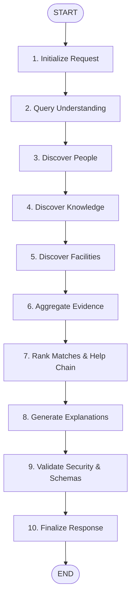

# CampusLink AI — Phase 9 LangGraph Agentic Workflow Orchestration

## Overview

Phase 9 introduces stateful, observable, fault-tolerant agentic workflow orchestration using **LangGraph** (`StateGraph`).
The orchestrator converts natural language problem statements into structured, evidence-backed recommendations by coordinating specialized discovery agents, matching engines, explanation providers, and security validators.

---

## Architecture & Graph Topology



---

## 10 Specialized Graph Nodes

| Step | Node Function | Responsibilities | Output Keys |
| :--- | :--- | :--- | :--- |
| **1** | `node_initialize_request` | Generates request UUID, ISO timestamps, and initial trace entry. | `request_id`, `started_at`, `agent_trace` |
| **2** | `node_understand_query` | Invokes `QueryUnderstandingAgent` to parse skills, techs, & domains. | `query_understanding`, `required_skills`, `domain` |
| **3** | `node_discover_people` | Finds campus experts via Phase 6 hybrid search. | `people_results`, `agent_trace` |
| **4** | `node_discover_knowledge` | Finds projects, research items, & previous solutions. | `project_results`, `research_results`, `solution_results` |
| **5** | `node_discover_facilities` | Finds campus labs & hardware equipment. | `facility_results`, `equipment_results` |
| **6** | `node_aggregate_evidence` | Deduplicates and normalizes evidence pointers. | `evidence`, `current_stage` |
| **7** | `node_rank_matches` | Computes candidate scores & constructs Help Chains. | `top_people`, `top_projects`, `help_chain` |
| **8** | `node_generate_explanations` | Generates grounded human-readable context explanations. | `top_people`, `current_stage` |
| **9** | `node_validate_results` | Filters sensitive internal content (`PRIVATE_RESUME`). | `warnings`, `current_stage` |
| **10** | `node_finalize_response` | Assembles state into `DiscoveryResponse` model. | `status`, `completed_at`, `current_stage` |

---

## State Management (`DiscoveryGraphState`)

`DiscoveryGraphState` relies on list/dict reducer functions (`reduce_list`, `reduce_dict`) to append agent trace entries, accumulate warnings, and preserve intermediate execution data safely.

```python
class DiscoveryGraphState(TypedDict, total=False):
    request_id: str
    user_id: str
    original_query: str
    query_understanding: Dict[str, Any]
    required_skills: List[str]
    required_technologies: List[str]
    domain: List[str]
    people_results: List[Dict[str, Any]]
    project_results: List[Dict[str, Any]]
    research_results: List[Dict[str, Any]]
    solution_results: List[Dict[str, Any]]
    facility_results: List[Dict[str, Any]]
    equipment_results: List[Dict[str, Any]]
    evidence: List[Dict[str, Any]]
    top_people: List[Dict[str, Any]]
    top_projects: List[Dict[str, Any]]
    help_chain: Optional[Dict[str, Any]]
    agent_trace: Annotated[List[Dict[str, Any]], reduce_list]
    errors: Annotated[Dict[str, Any], reduce_dict]
    warnings: Annotated[List[str], reduce_list]
    status: str
    current_stage: str
```

---

## Error Handling & Recovery Strategy

1. **Isolation**: Individual branch failures do not crash the workflow; failures are recorded in `errors` dict while non-failing branches proceed.
2. **Partial Success**: If one branch fails (e.g. facility search times out), status falls back to `PARTIAL_SUCCESS` and returns usable people & project matches.
3. **Execution Timeouts**: `MAX_GRAPH_RUNTIME_SECONDS = 30.0` prevents hanging graph executions.
4. **Security Validation**: `node_validate_results` strips private flags before client serialization.

---

## Verification & Testing

- Automated Test Suite: `apps/api/tests/test_langgraph_workflow.py` (18 unit & API test cases).
- API Endpoint: `POST /api/v1/agents/discover`.
